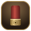

<div align="center">



# Keyfire

**Every keystroke fires.**
Typing sounds, ambience, music and a room to play them in, all reacting to how you type.

[](#-install)
[](https://www.electronjs.org)
[](#-keyboard-packs)
[](package.json)
[](package.json)

[Features](#-features) · [Install](#-install) · [Quick start](#-quick-start) · [Typing-speed music](#-music-that-follows-your-typing) · [Build](#-build-from-source) · [Credits](#-credits)

</div>

---

## ✨ What is Keyfire?

Keyfire is a Windows app that plays a sound for **every key you press, in any app**. Pick a shotgun kit or a
keyboard pack, then wrap it in a rain storm, a lo-fi playlist and a little room reverb. One click
loads the whole mood as a **scene**.

What sets it apart: the sound **reacts to your typing speed**. Ambience swells, music rises and brightens, and
fast bursts fire tighter shots.

## 🎯 Features

### 🔫 Sounds
- **Shotgun kit** with per-key roles: letters blast, <kbd>Space</kbd> booms, <kbd>Enter</kbd> pumps the action,
  <kbd>Backspace</kbd> drops a shell, modifiers give a soft brass tick.
- **Synthesized shotgun** that needs no files at all.
- **Keyboard packs**: import a `.zip` or a folder (or a parent folder with many packs). Single-file and
  per-key packs both work, with key-release sounds.
- **Your own sounds**: drop in loose `.ogg`, `.wav` or `.mp3` files.
- **Per-key overrides**: give any key its own sound from the on-screen keyboard.
- **Mouse and scroll sounds** with their own pack and volume.

### 🎚️ Tone and feel
- **Tone profiles**: Deep thock, Crisp and clicky, Warm, Bright, Soft and quiet, Punchy, Wide, Vintage.
- Fine controls for **bass, presence, treble, pitch and stereo width**.
- **Loudness follows typing speed**: fast bursts get softer or harder, like a real keyboard.
- **Full-auto mode**: fast typing fires tighter shots; pausing after a burst racks the pump.
- Per-key stereo panning, pitch and volume variation, room reverb.

### 🌧️ Atmosphere
- **Ambience beds**: recorded rain, storm (with thunder), highway and running water, plus synthesized wind,
  soft rain, night and room tone.
- **Add your own loops**: seamless and auto-levelled.
- **Layers**: stack up to three beds, each with its own volume.
- **Reactive ambience**: fast typing brightens and swells the bed; it relaxes when you stop.
  A storm cracks **thunder on <kbd>Enter</kbd>** after a burst.
- **Music player** for your own tracks (streamed, never loaded into memory) with shuffle.
- **Music profiles**: Original, Ambient, Background, Lo-fi, Warm, Bright, Bass boost, Night, with a
  **Compare with original** button.

### 🎼 Music that follows your typing
Turn on **Follow my typing speed** and the music moves with you:

| Option | Fast typing | Slow typing |
|---|---|---|
| **Volume** (always on) | Up to your music volume | Dips low |
| **Tempo** | Quicker, pitch unchanged | Slower |
| **Brightness** | Open and clear | Dull and muffled |
| **Reverse** | Calm music while you type fast, lively when you slow down | |

The **Amount** slider sets how far it moves. Turn the mode off and your music returns to the level you set.

### 🎬 Scenes
One click loads a sound, ambience and room together: **Range day, Canyon, Storm, Night watch, Rainy desk,
Night shift, Quiet desk**. Save your own with **Save current**.

### 🍅 Focus
A built-in focus timer with its own scene for **focus, short breaks and long breaks**, a configurable cycle,
optional auto-start, a soft chime and a Windows notification.

### 🤫 Automation
- **Quiet hours**: mute on the days and times you choose.
- **Mute during calls** while any app is using your microphone.
- **Mute in fullscreen apps**, so games and videos stay clean.
- **App rules**: a scene or mute per application.

### 📊 Play and stats
- Live **WPM**, bursts and key counter, plus a **try-it box**.
- **Achievements** for streaks and speed (60 WPM, 100 WPM and more).
- **On-screen keyboard** that lights up as you type.

### 🎨 Appearance
- Dark, light or **follow Windows**.
- Six dark and six light themes: Midnight, Charcoal, Walnut, Forest, Plum, Black, Snow, Paper, Sand, Mint,
  Rose, Mist.
- Eight accent colors, custom backgrounds and a reset button.

### ⚙️ Settings and reliability
- **Global hook**: works in every app. <kbd>F9</kbd> pauses and resumes from anywhere (rebindable).
- **Tray icon**: closing the window keeps the sounds running. Start with Windows, single instance.
- **Output device picker**, with volume remembered per device and boost above 100% (limiter built in).
- **Awake audio engine**: no wake-up delay after idle. Voice cap with oldest-first eviction.
- **Health panel**: key hook status, audio status, last key-to-sound latency. The hook restarts itself if it stops.
- **Command line**: `--headless` (no window or tray), `--hidden`, `--soundpack=<id>`.

## 📦 Install

> Download the latest installer from the **Releases** page, or [build it yourself](#-build-from-source).

Unsigned builds show a Windows SmartScreen warning the first time: choose **More info → Run anyway**.

## 🚀 Quick start

1. Launch Keyfire. Type anywhere and you hear it.
2. **Play** tab: pick a **scene** for an instant mood, or adjust the mix.
3. **Sounds** tab: choose a pack, then shape it with a **tone profile**.
4. **Atmosphere** tab: add rain, layer a storm, play a track, and switch on **Follow my typing speed**.
5. Press <kbd>F9</kbd> any time to pause. Close the window and Keyfire keeps running in the tray.

## ⌨️ Keyboard packs

Keyfire bundles 18 keyboard packs: **Cherry MX Black, Blue, Brown and Red** (ABS and PBT), **Cream
Travel, EG Crystal Purple, EG Oreo, Holy Pandas, MX Black / Blue / Brown Travel, NK Cream, Topre Purple
Hybrid PBT** and **Turquoise**. Import more from **Sounds → Add**.

Packs use the common V2 pack format, so packs you already have work unchanged.

## 🗂️ Your files

Everything lives in `%APPDATA%\Keyfire\`:

```
settings.json   packs\   sounds\   kit\   ambience\   music\
```

Override any shotgun role by dropping files named `blast-*`, `boom-*`, `pump-*` or `shell-*` into `kit\`.

## 🛠️ Build from source

```bash
npm install
npm start          # run in development
npm run dist       # build the Windows installer into dist/
```

Other scripts: `npm run icons` (regenerate Lucide icons), `npm run perf` and `npm run monitor` (see
[docs/perf.md](docs/perf.md)).

## 🧱 Architecture

```
main.js                window, tray, global key hook (uiohook-napi), settings, all IPC
preload.js             the minimal window.sk bridge (contextIsolation on)
renderer/audio.js      Web Audio engine: buses, reverb, limiter, synth sounds, ambience, music
renderer/packs.js      synth, kit, your files and keyboard pack loaders
renderer/scenes.js     built-in scenes
renderer/ui/           one module per tab, plus the key-press hot path (input.js)
```

Sounds are pre-decoded, and the keypress path has no `await`. See [CLAUDE.md](CLAUDE.md) for conventions and
[ROADMAP.md](ROADMAP.md) for what's next.

## 🔒 Privacy and security

Keyfire reads key *codes* only to trigger sounds. Nothing is recorded, stored or sent anywhere. The renderer
runs with `contextIsolation`, no `nodeIntegration` and a strict content security policy.

## 🙏 Credits

- Bundled shotgun and ambience audio: CC0, see [SOUND-SOURCES.md](SOUND-SOURCES.md) and `assets/*/CREDITS.md`.
- Icons: [Lucide](https://lucide.dev), ISC licence (`assets/LICENSE-lucide.txt`).

## 📄 License

MIT © Muhammad Vahaj
